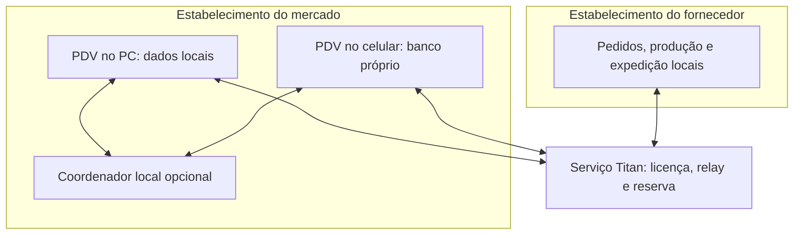

# TitanSystem — componentes e sincronização (Fase 1)

**Estado:** contrato de arquitetura proposto em 29/09/2026. Este documento descreve comportamento a implementar; não afirma que os aplicativos atuais já o executem.

## Produto inicial

Mercados e fornecedores/produtores. O primeiro fluxo comercial completo é venda → movimento de estoque → sugestão de reposição → aprovação do mercado → confirmação do fornecedor → horário confirmado de descarga → recebimento conferido → financeiro e exportação autorizada ao contador. Funcionários podem usar o smartphone para ponto, tarefas e metas; gerentes registram avaliação privada. Fornecedores acompanham produção por etapa. Consumidor, salão, oficina e promoções públicas ficam fora da primeira entrega.

## Topologia proposta

- Cada aparelho que registra operações conserva seu próprio banco local e sua fila de envio. O celular não depende do PC para concluir uma venda local.
- O coordenador local, se instalado, facilita a comunicação pela rede da loja. Sua ausência ou queda não pode impedir o registro local no celular. Ele não deve abrir o mesmo arquivo SQLite por compartilhamento de rede.
- O serviço Titan transporta mensagens autorizadas e pode arbitrar horários de doca. O desenho padrão evita acesso livre do operador Titan a vendas, itens, custos, folha e documentos.
- Uma implantação de nuvem privada ou hospedagem escolhida pelo cliente é opção futura. A localização física e o modelo de cobrança exigem decisão comercial antes da implantação.
- O aplicativo web atual ainda aponta para `http://localhost:8080/api/v1`; isso serve apenas para o PC local. Acesso de outro computador, smartphone, HTTPS e descoberta do servidor exigem implementação e teste próprios.

## Limites da conectividade

| Situação | Operação permitida | Operação pendente |
|---|---|---|
| Internet indisponível, rede local ativa | Venda, caixa e movimentos no dispositivo; troca local quando houver coordenador acessível | Entrega à nuvem, fornecedor, contador e confirmação global da doca |
| Rede local indisponível | Venda no banco próprio de cada dispositivo já autorizado | Troca entre dispositivos, saldo consolidado e solicitações externas |
| PC desligado | Celular autorizado vende no seu banco local | Funções que dependam de periféricos ligados ao PC e reconciliação com ele |
| Energia indisponível | Apenas dispositivo que permaneça ligado pode registrar operação | Caixa/periféricos sem energia e qualquer serviço local desligado |

Offline não significa que PIX, cartão, autorização fiscal, reserva de doca ou mensagem ao fornecedor estejam confirmados. A interface precisa mostrar `local`, `pendente`, `confirmado` ou `falhou` com origem clara.

## Contrato de sincronização

1. Uma operação crítica grava entidade, movimentos, auditoria e evento de outbox em **uma transação** do banco local.
2. Cada evento tem `event_id` global, `tenant_id`, `store_id`, `device_id`, `aggregate_id`, tipo, versão de esquema, sequência do agregado, data local e payload. O servidor extrai a identidade autorizada da sessão e confronta os IDs, sem confiar apenas no corpo.
3. O emissor reenvia eventos até obter confirmação durável. O receptor guarda uma chave de idempotência e devolve o mesmo resultado para repetição; a confirmação é gravada localmente antes da remoção lógica da pendência.
4. Mensagens de entrada são persistidas em inbox, verificadas e aplicadas atomicamente. Catálogo e políticas possuem versões e data de vigência; versões antigas não substituem novas sem regra explícita.
5. Exclusão física e `última gravação vence` não resolvem conflitos de venda, pagamento, estoque, produção ou doca. Correção é feita por evento compensatório auditável.
6. Dois aparelhos podem vender enquanto isolados; portanto, saldo global exato não pode ser prometido em tempo real. Para itens críticos, definir cota por dispositivo ou exigir conexão; para os demais, registrar risco de venda acima do saldo e reconciliar com intervenção humana.
7. Retenção, reenvio, tamanho dos lotes, versões incompatíveis, relógio incorreto e restauração de backup precisam de testes antes de produção.

## Periféricos e emissão fiscal

Leitor, balança, gaveta e impressora operam no dispositivo que os controla. Comprovante **não fiscal** é identificado como tal. Integrações fiscais dependem de projeto, homologação e regras aplicáveis; não se deve chamar uma venda offline local de nota fiscal autorizada.

## Estado do repositório ao fim da Fase 0

`backend/` (Go/Fiber/PostgreSQL) e `frontend-web/` (React/Vite) são as árvores usadas no build observado. Existem `desktop/`, `mobile/` e cópias em `TitanSystem/`, ainda sem validação funcional completa. Testes Go e build web passaram; as duas imagens Docker foram construídas. A execução conjunta do Compose, a venda offline e a comunicação entre empresas **não foram demonstradas**.
